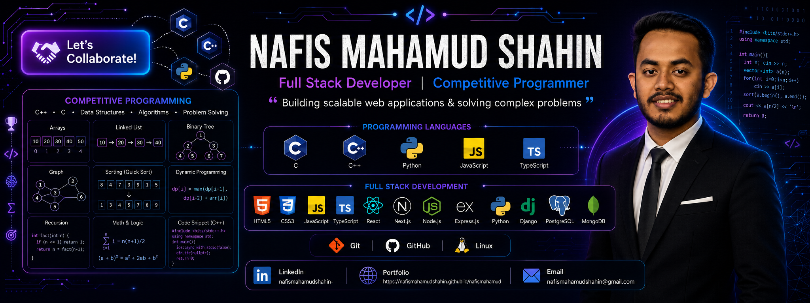

 <!--  -->

 

---

## 💫 About Me
- 💻 Backend Developer specializing in Python, Django & Django REST Framework
- 🏆 Competitive Programmer on Codeforces and CodeChef
- ⭐ CodeChef 2-Star Programmer
- 🔥 Passionate about Problem Solving, Data Structures & Algorithms
- 🌱 Currently learning React, TypeScript & Next.js
- 🎓 Computer Science & Technology Student
- 📚 Always learning new technologies and building real-world projects

---

## 🛠️ Languages & Tools

### 🧠 Languages

  
  
  
  
  

### 🎨 Frontend

  
  
  
  
  
  

### ⚙️ Backend

  
  
  
  
  

### 🗄️ Database

  
  
  
  

### 🛠️ Tools & Platforms

  
  
  
  
  

---

## 🤝 Connect With Me

  
  
  
  

---

## 📊 Competitive Programming

  
  

---

## 📈 GitHub Activity

  
    

  
 
---
